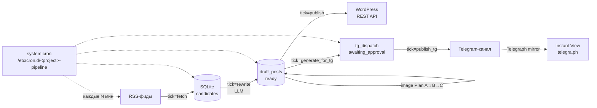

# Media Fabrique Template

> **Self-hosted RSS → LLM-rewriter → WordPress / Telegram pipeline.**
> Шаблон — форкни, адаптируй под свою тему, задеплой.

[](LICENSE)
[](requirements.txt)
[](.github/workflows/ci.yml)
[](https://github.com/DimbikeY/media-fabrique-template)

[🇬🇧 English version](docs/en/README.md)

---

## TL;DR

Готовый пайплайн для новостного канала: тянет RSS-фиды, отдаёт текст в LLM
на пересказ, генерирует картинку, публикует в WordPress и Telegram-канал.
Не заточен под конкретную тематику — источники, промпты и категории
параметризованы, чтобы можно было форкнуть под свой домен: отраслевые
новости, нишевые сообщества, корпоративный мониторинг, дайджесты
исследований.

Latency от RSS-fetch до публикации в канале — около 30 минут в steady state.
Один 2GB VPS справляется с 30+ постами в день.

## Зачем этот шаблон

Я собрал оригинальный пайплайн для своего новостного канала и выделил
переиспользуемое ядро. Форкни, поменяй RSS-сорсы на свои, перепиши
промпт под свою тему, укажи свой WordPress и Telegram-канал — через час
у тебя рабочий конвейер. Весь state — SQLite, миграции включены,
smoke-тесты в изоляции.

Это **шаблон**, а не production-продукт: нет встроенной телеметрии,
нет автообновлений, нет SLA. Используй на свой страх и риск, без
гарантий и обязательств по поддержке. Если нужна помощь — открывай
[issue](https://github.com/DimbikeY/media-fabrique-template/issues).

## Демо

- **Telegram-канал** с живыми публикациями: `@<your_channel>` (замени на свой)
- **Longread (RU)** с архитектурным разбором (10 секций): <https://github.com/DimbikeY/media-generation-fabrique/blob/public-release-clean/docs/longread-ru.md>
- **Issues**: <https://github.com/DimbikeY/media-fabrique-template/issues>

## Архитектура



**Один цикл конвейера = один cron-тик.** Каждый компонент запускается
независимо, читает и пишет SQLite-стейт идемпотентно (UPDATE ... WHERE
status=? AND id=? с проверкой rowcount==1). Подробнее — в
[`docs/architecture/`](docs/architecture/).

## Quickstart (≤ 30 минут)

```bash
# 1. Клонировать и установить зависимости
git clone https://github.com/DimbikeY/media-fabrique-template.git
cd media-fabrique-template
python3 -m venv .venv && source .venv/bin/activate
pip install -r requirements.txt

# 2. Скопировать шаблон env и заполнить ключи
cp .env.example .env
$EDITOR .env   # заполнить:
               #   LLM_BASE_URL, LLM_API_KEY, LLM_MODEL
               #   WP_BASE_URL, WP_USERNAME, WP_APP_PASSWORD
               #   TELEGRAM_BOT_TOKEN, TELEGRAM_ADMIN_GROUP_CHAT_ID,
               #     TG_DD_USERNAME, TG_CHANNEL_ID, TG_CHANNEL_USERNAME

# 3. Инициализация SQLite + миграции
python init_db.py
python migrate.py

# 4. Первый прогон пайплайна вручную
python main.py tick=fetch       # скачать RSS в candidates
python main.py tick=rewrite     # LLM-пересказ + scoring
python main.py tick=publish     # опубликовать в WordPress
python main.py tick=janitor     # почистить expired

# 5. Настроить cron на VPS — см. docs/architecture/07-self-host.md
```

После `tick=fetch` в `data/news_memory.db` появятся записи в таблице
`candidates`. Если RSS-фиды пустые или LLM-ключ неверный — `tick=rewrite`
упадёт с понятным traceback в `logs/`.

## Features

- **State machine в SQLite.** `candidates` (new → rewriting → ready /
  skipped / failed), `draft_posts` (draft → publishing → published /
  failed), `tg_dispatch` (pending_tg_text → awaiting_approval → approved
  → published_tg / rejected_tg). Идемпотентные UPDATE с rowcount==1,
  миграции через `migrate.py` (идемпотентные, track в `_migrations`).
- **Cron вместо оркестратора.** System cron + systemd unit, отдельный
  tick для каждой фазы: `tick=fetch`, `tick=rewrite`, `tick=publish`,
  `tick=janitor`, `tick=generate_for_tg`, `tick=publish_tg`. Backoff,
  jitter, error handling в каждом тике. См.
  [`docs/architecture/03-cron-architecture.md`](docs/architecture/03-cron-architecture.md).
- **LLM через OpenAI-совместимый SDK.** `openai>=1.40` работает с любым
  провайдером: OpenAI, Anthropic-совместимые endpoint'ы, локальные модели.
  Tenacity retries, prompt version pinning (`prompts.TG_PROMPT_VERSION`).
- **Categorization (closed-set).** 12 категорий whitelist'ом — LLM не
  классифицирует в runtime, только выбирает из списка. Экономит токены
  и стабилизирует результат. См.
  [`docs/architecture/04-categorization.md`](docs/architecture/04-categorization.md).
- **Telegram-канал + Instant View без Premium.** Telegraph mirror с
  полным телом поста. `tg_dispatch` отдельно от WordPress (two-stage):
  WP-публикация и TG-публикация независимы — TG не может откатить WP-пост.
  См. [`docs/architecture/06-telegram-specifics.md`](docs/architecture/06-telegram-specifics.md).
- **Image pipeline (Plan A→B→C→D).** WebP lossy q=82 method=6 (WP 5.8+
  принимает нативно) → upstream image из RSS → image-gen API → placeholder.
  Inline в publisher, не отдельный cron.
- **Self-hosted, single VPS.** Один 2GB VPS справляется с 30+ постами/день.
  SQLite для состояния, никаких внешних зависимостей кроме LLM API.
  Backups — `cron` + `sqlite3 .backup`.

## Tech stack

- **Python 3.11+**, `.venv` (создаётся локально)
- **SQLite** для state + миграции (`migrate.py`)
- **OpenAI-совместимый SDK** для LLM (`openai>=1.40`)
- **WordPress REST API + Application Passwords** для публикации
- **Telegram Bot API + Telegraph API** для канала и Instant View
- **Pillow** для image pipeline (WebP encode)
- **feedparser + readability-lxml** для RSS и нормализации HTML
- **Tenacity, loguru** — retries и structured logging

## Customize (где форкать под свою тему)

| Компонент | Файл / место | Что поменять |
|---|---|---|
| RSS-фиды | `rss_fetcher.py` | Список источников и фид-парсеры |
| Главный промпт | `master_prompt.md` | Системные инструкции для LLM (RU/EN, tone, длина) |
| TG-промпт | `master_prompt_tg.md` + `prompts.py` | Формат TG-preview, эмодзи, hashtag-стиль |
| Категории | `config.py` (`CATEGORIES_WHITELIST`) | Свой набор закрытых тем |
| State machine | `models.py` + `migrate.py` | Свои статусы при необходимости |
| Cron-расписание | `deploy/<project>-pipeline.cron` | Интервалы под свой объём |
| Branding | README + Telegraph + TG channel handle | Имя, лого, описание |
| Image prompt | `image_pipeline.py` (`build_prompt`) | Стиль картинок под свою тему |
| Deploy | `deploy/vps-b-setup.sh` (или свой) | Адаптация под своего VPS-провайдера |

## Self-host

Полный гайд — [`docs/architecture/07-self-host.md`](docs/architecture/07-self-host.md):
prerequisites (VPS 2GB, домен, TG bot, OpenAI-совместимый ключ), step-by-step
deploy на Ubuntu 24.04, systemd unit, `/etc/cron.d/<project>-pipeline`, nginx
reverse proxy (если нужен), SQLite backups.

Краткий чеклист перед запуском в прод — в
[`docs/architecture/08-operational-playbook.md`](docs/architecture/08-operational-playbook.md).

## Contributing

Issues welcome. Без предварительного issue PR не принимаются —
обсудим дизайн до кода. Code review строгий:

1. 100% smoke pass (`test_*_smoke.py` в изолированной БД)
2. Manual test на чистом clone перед merge
3. Соответствие существующему стилю кода (typing, docstrings, naming)

Лицензия — [MIT](LICENSE). Используй где угодно, форкай свободно,
ссылка на оригинал приветствуется но не обязательна.

## Лицензия

[MIT](LICENSE) — см. файл. Copyright возвращается контрибьюторам
через CLA (если проект станет больше одного мейнтейнера).

## Disclaimer

**Это шаблон, не production-ready продукт.**

- Используй **на свой страх и риск**, без каких-либо гарантий.
- Автор **не предоставляет техническую поддержку** и не несёт
  ответственности за misuse, потерю данных или нарушение TOS третьих сторон.
- Перед использованием убедись, что ты соблюдаешь:
  - **TOS своих RSS-источников** — не все фиды разрешают republication.
    Уважай robots.txt, rate limits и явные просьбы авторов.
  - **[Telegram ToS](https://telegram.org/tos)** — особенно раздел про
    массовые рассылки и автоматизацию.
  - **[OpenAI ToS](https://openai.com/policies/row-terms-of-use/)** —
    лимиты, restricted use cases, требования к атрибуции.
  - **WordPress.com / .org ToS** — automated publishing допустим, но
    без спама.
  - **Авторские права источников** — пересказ через LLM ≠ полная
    republication. Делай summary, не copy-paste, и указывай источник.

Этот репо не претендует на «production-ready» статус и не заменяет
консультацию с юристом по специфике твоего юрисдикции и сценария.

## Acknowledgments

Открытый код, на котором это стоит:

- [OpenAI Python SDK](https://github.com/openai/openai-python)
- [feedparser](https://github.com/kurtmckee/feedparser)
- [Pillow](https://github.com/python-pillow/pillow)
- [Tenacity](https://github.com/jd/tenacity)
- [Loguru](https://github.com/Delgan/loguru)
- [python-telegram-bot](https://github.com/python-telegram-bot/python-telegram-bot) (опционально)
- [Telegraph API](https://telegra.ph/api) — Instant View без Premium
- [Readability](https://github.com/buriy/python-readability) — нормализация HTML

---

🇬🇧 [English version](docs/en/README.md) · [Архитектура](docs/architecture/) · [Issues](https://github.com/DimbikeY/media-fabrique-template/issues) · [MIT License](LICENSE)