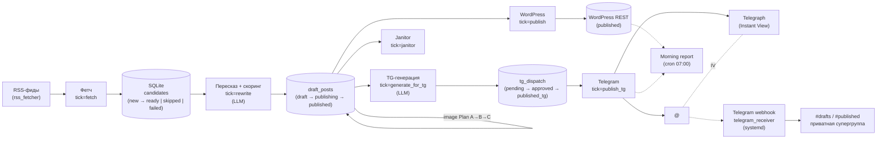
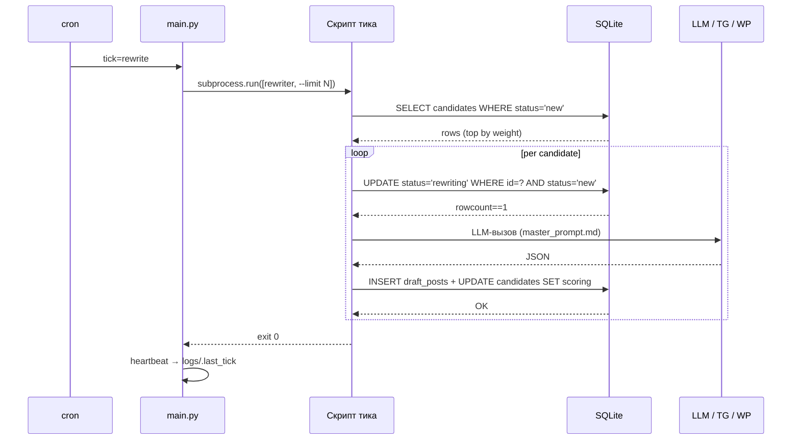

# 00 — Обзор Media Fabrique

## TL;DR

Self-hosted конвейер **RSS → LLM-пересказ → WordPress + Telegram-канал** с
изолированным state в SQLite и оркестрацией через системный cron.
Шаблон: форкни, поменяй RSS-сорсы и промпты, разверни на своём VPS — через
час у тебя рабочий конвейер публикации новостей под собственным доменом.

## Что это

Media Fabrique — это **шаблон** пайплайна, не production-продукт.
Параметризованы все тематические зависимости (источники, промпты,
категории), чтобы один и тот же код работал для отраслевых новостей,
нишевых сообществ, корпоративного мониторинга, дайджестов исследований.
Весь state — SQLite с миграциями, smoke-тесты изолированы во временной БД.
Один 2 GB VPS справляется с 30+ постами в день; latency от RSS-fetch до
публикации в канале — около 30 минут в steady state.

## Компоненты

## Поток данных

Один цикл конвейера — это **один cron-тик**: компонент запускается,
читает и пишет SQLite-стейт идемпотентно, выходит. Никакого общего
in-memory состояния, никакого long-running orchestrator'а. Tick
манифест живёт в одном месте — `main.py:TICK_REGISTRY` —
и исполняется через `subprocess.run()` против соответствующего
standalone-скрипта (`rss_fetcher.py`, `rewrite_and_score.py`,
`publisher.py`, `generate_for_tg.py`, `publish_tg.py`, `janitor.py`).
Это позволяет одни и те же CLI использовать из cron'а, из ручного
запуска разработчиком, из smoke-тестов — без отдельной кодовой базы.

## Почему это шаблон

Я собрал оригинальный пайплайн под конкретный новостной канал и
выделил переиспользуемое ядро. Решение **не претендует на масштаб
Airflow / k8s**: один процесс на одной VPS, никакой внешней
state-store кроме SQLite, никакой авто-телеметрии. Это явный выбор в
пользу того, что можно прочитать за вечер и поправить за час.
Шаблон параметризован так, чтобы форк под свою тему сводился к
редактированию `rss_fetcher.py:DEFAULT_SOURCES`, `master_prompt.md` и
`config.py:CATEGORIES_WHITELIST` — без переписывания ядра.

Что **не включено** в шаблон и что вам придётся делать самим:

- Хостинг VPS, регистрация домена, настройка DNS
- Получение Application Password в WP и токенов у LLM-провайдера / TG BotFather
- Решение юридических вопросов: TOS ваших RSS-источников, TG ToS,
  авторские права. Пересказ через LLM ≠ полная republication; делайте
  summary с указанием источника.

## Где форкать

| Под свою тему | Файл |
|---|---|
| RSS-источники | `rss_fetcher.py:DEFAULT_SOURCES` + `sources` таблица |
| Главный промпт | `master_prompt.md` |
| TG-промпт | `master_prompt_tg.md` |
| Категории и half-life | `scoring.py:CATEGORY_HALF_LIFE_H` |
| Cron-расписание | `config.py:PIPE_TICKS` → `deploy/<project>-pipeline.cron` |
| Брендинг TG-канала | `_DISPLAY_DOMAIN` и footer-тексты в `tg_channel_publisher.py` |
| Scoring | `scoring.py` (форкнуть `score_item`) |

## Следующее

- [`01-pipeline.md`](01-pipeline.md) — поэтапная модель и latency budget.
- [`02-state-machine.md`](02-state-machine.md) — конечные автоматы в SQLite.
- [`03-cron-architecture.md`](03-cron-architecture.md) — почему cron, а не оркестратор.
