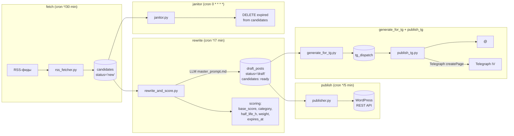

# 01 — Конвейер: фазы, тики, latency

## TL;DR

Конвейер — это **последовательность cron-тиков**, каждый из которых
делает одну вещь и завершается. Один тик — один подпроцесс,
идемпотентный по своей части SQLite-стейта. Никакого глобального
orchestrator'а: state-machine + atomic UPDATE держат параллельные тики
без конфликтов.

## Фазы



Каждый блок — отдельный тик, отдельный cron-job, отдельный скрипт.
Связь между блоками — только через SQLite.

## Tick model

**Каждый cron tick = один шаг.** Архитектурно это означает:

1. Cron запускает `python main.py tick=<name>` каждые N минут.
2. `main.py` смотрит в `TICK_REGISTRY`, поднимает дочерний процесс
   `python -m <script_module> [<default args>] [--limit N]`.
3. Скрипт работает в синхронном режиме: SELECT → UPDATE → (опционально
   внешний API) → COMMIT → exit.
4. Exit code ребёнка становится exit code'ом main.py; результат
   записывается в `logs/.last_tick` (heartbeat JSON) для forensic-анализа.

Почему **один шаг, а не "один большой пайплайн"**:

- **Crash-isolation.** Если `publish_tg` падает на Telegraph, это
  никак не мешает `publish` (WP) — следующий тик подхватит.
- **Latency видна сразу.** Можно посмотреть `logs/.last_tick` и
  понять, что `tick=rewrite` отстал на 12 минут, а не гадать "где
  оно висит".
- **Concurrency control бесплатно.** Каждый тик читает только то,
  что ему положено (`candidates.status='new'`), и атомарно
  забирает строки через `UPDATE ... WHERE id=? AND status='new'`
  с проверкой `rowcount == 1`. Никаких lock-файлов.
- **Отладка в dev.** Тот же `python main.py tick=fetch` запускается
  руками и в CI — без mock-окружения orchestrator'а.

## Latency budget

В таблице — типичные времена в steady state при cron-расписании
из `config.py:PIPE_TICKS` (`*/30`, `*/7`, `*/5`, `*/10`).

| Фаза | Cron | Min latency | Median | Worst case | Что определяет |
|---|---|---|---|---|---|
| RSS fetch → `candidates.status='new'` | `*/30` | 0 мин | 15 мин | 30 мин | cron-интервал |
| `new` → LLM → `draft_posts.draft` + `ready` | `*/7` | 0 мин | 7 мин | 14 мин | cron + время LLM |
| `draft` → `published` в WP | `*/5` | 0 мин | 5 мин | 10 мин | cron + WP REST |
| `published` → TG-channel + Telegraph | `*/10` | +5 мин | +10 мин | +20 мин | Telegraph API (3 retries × ~1s) |
| Telegraph mirror | inline в `publish_tg` | 1 с | 2 с | 30 с (3 retry) | api.telegra.ph latency |
| **End-to-end** | — | **~10 мин** | **~30 мин** | **~50 мин** | — |

Ключевые наблюдения:

- WP-публикация **не блокирует** TG-публикацию. Sprint Y перешёл на
  трёхстадийную модель: `publish` (только WP) → `generate_for_tg`
  (LLM по WP-посту) → `publish_tg` (Telegraph + TG-channel). Сбой
  TG **не откатывает** уже опубликованный WP-пост.
- Half-life (см. [`05-half-life-scoring.md`](05-half-life-scoring.md))
  ставит верхнюю границу: через `expires_at` кандидат удаляется
  janitor'ом, даже если он не дошёл до публикации.
- TG Bot API rate limits — 30 msg/sec глобально, 1 msg/sec per chat
  (см. [`06-telegram-specifics.md`](06-telegram-specifics.md)).
  При нашем объёме (≤5 сообщений за один `publish_tg` тик) это не
  проблема; при увеличении объёма — добавить `time.sleep(1.0)`
  между `sendMessage` вызовами.

## Tick example: что внутри `tick=fetch`

`main.py` для `tick=fetch` запускает:

```python
TICK_REGISTRY = {
    "fetch": {
        "module": "rss_fetcher",
        "args": ["--max", str(PIPE_TICKS.fetcher_max)],
    },
    ...
}
```

`rss_fetcher.py:run()` за один прогон:

```python
def run(max_items: int, only_source: Optional[str] = None) -> dict:
    stats = {"fetched_feeds": 0, "matched": 0, "inserted": 0, ...}
    conn = connect()
    ensure_default_sources(conn)

    sources = conn.execute("SELECT * FROM sources WHERE enabled=1").fetchall()
    if only_source:
        needle = only_source.strip().lower()
        sources = [s for s in sources if (s["name"] or "").lower() == needle]

    inserted_total = 0
    for src in sources:
        if max_items and inserted_total >= max_items:
            break
        try:
            feed = fetch_feed(src["feed_url"])   # tenacity retry × 3
        except Exception as e:
            log.error("feed failed: %s — %s", src["name"], e)
            continue
        # ... parse entry, dedup by (source_id, guid), INSERT ...
    conn.commit()
    return stats
```

Идемпотентность обеспечивает `UNIQUE (source_id, guid)` +
`INSERT OR IGNORE`-семантика через пре-SELECT. Если cron запустит
тот же тик дважды за минуту — ничего не сломается, дубликатов не
появится.

## Зачем так

Один тик на фазу — это **не rocket science**, а сознательный отказ
от premature complexity. У нас нет вложенных DAG, нет условных
веток "если X, то Y", нет retry-orchestrator'ов поверх retry-в-скриптах.
Каждый retry живёт в одном месте (tenacity в `rss_fetcher`,
`_http_post_with_retry` в `telegraph`), каждый idempotency claim —
в одном SQL-запросе. Этот контракт удерживает кодовую базу на ~1500
строках продакшн-кода без потери надёжности: см. тесты
`test_*_smoke.py` — 19+ проверок на изолированной БД, которые
прогоняются за <30 секунд и покрывают state-transitions.

## Где форкать

| Хочется | Файл |
|---|---|
| Добавить новый тик | `main.py:TICK_REGISTRY` + новый standalone скрипт |
| Поменять интервал | `config.py:PIPE_TICKS.fetcher_cron` и т.д. |
| Поменять batch size | `config.py:PIPE_TICKS.<role>_limit` или `--limit N` |
| Добавить фильтр-фазу перед rewrite | `rss_fetcher.py` или новый `topic_classifier.py` |
| Добавить новый sink после WP | `publisher.py:process_one()` (пост-хука) |

## Следующее

- [`02-state-machine.md`](02-state-machine.md) — детали переходов между статусами.
- [`03-cron-architecture.md`](03-cron-architecture.md) — почему cron, расписание, jitter.
- [`05-half-life-scoring.md`](05-half-life-scoring.md) — как выбирается приоритет в `tick=rewrite`.
