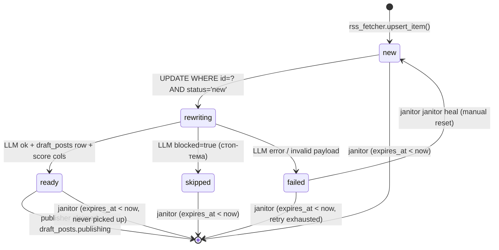
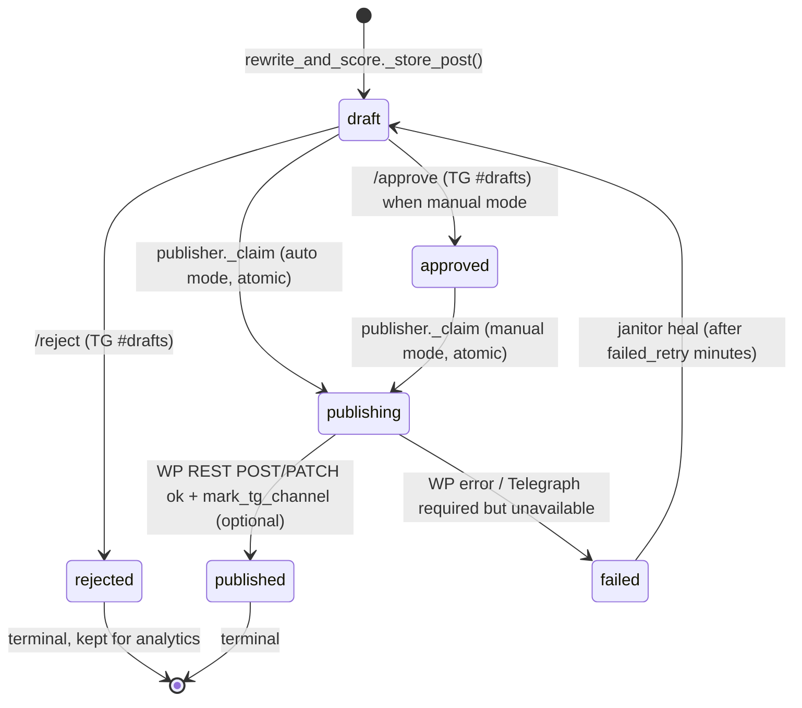
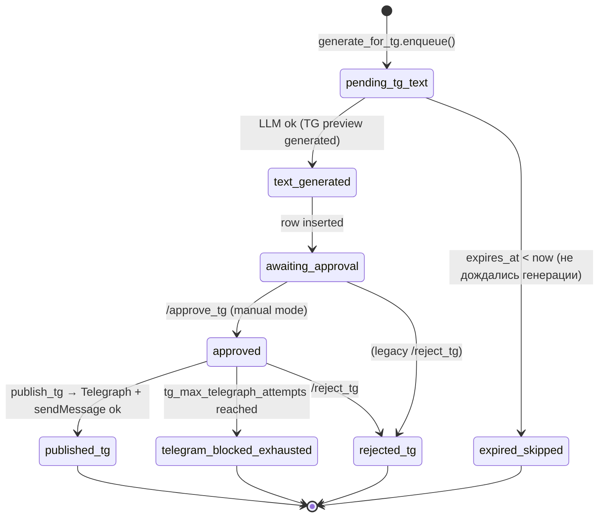
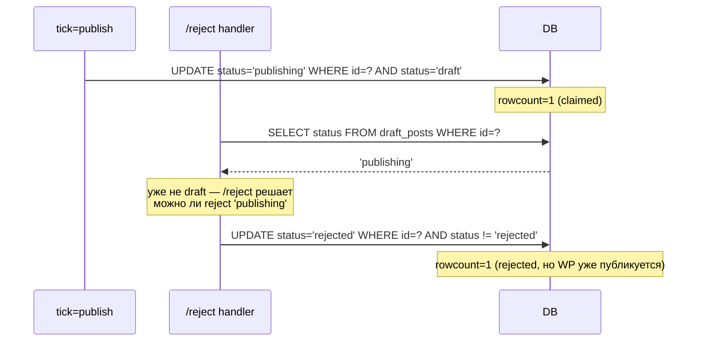

# 02 — Конечные автоматы в SQLite

## TL;DR

Все три ключевые таблицы (`candidates`, `draft_posts`, `tg_dispatch`)
— это **state machines на SQL**. Переход между состояниями —
`UPDATE ... WHERE id=? AND status=?` с проверкой `cur.rowcount == 1`.
Никаких внешних lock'ов, никакого Redis — один writer в один момент
времени благодаря SQLite WAL и коротким транзакциям.

## `candidates` — новый → пересказ → готово



### Каждый переход

| Из → В | Где | SQL / логика |
|---|---|---|
| ∅ → `new` | `rss_fetcher.upsert_item` | `INSERT INTO candidates (..., status='new', safety_status='review')` |
| `new` → `rewriting` | `rewrite_and_score._claim` | `UPDATE candidates SET status='rewriting', error_reason='worker:HOST:PID' WHERE id=? AND status='new'` (rowcount==1) |
| `rewriting` → `ready` | `_mark_ready_with_score` | один UPDATE — `status`, `error_reason=NULL`, и score-колонки (см. [`05-half-life-scoring.md`](05-half-life-scoring.md)) |
| `rewriting` → `skipped` | `_mark_skipped` | `safety_status=violent|political|vpn|inoagent|meta|review` по LLM `reason` |
| `rewriting` → `failed` | `_mark_failed` | `error_reason` обрезается до 500 символов (защита от раздувания строки) |
| `failed` → `new` | janitor heal | `JANITOR_FAILED_RETRY_MINUTES=60` — manual retry window |

`error_reason` — это soft-marker `worker:HOST:PID` пока строка в
"active" состоянии; перезаписывается при каждом переходе. Если
cron-тик умер посреди работы, в БД остаётся последний worker-id —
полезно для forensic-анализа застрявших строк.

## `draft_posts` — черновик → публикация



### Атомарный claim

```python
# publisher.py:_claim
if PIPE_TICKS.wp_publish_auto_approve:
    claim_clause = "status = 'draft'"
else:
    claim_clause = "status = 'approved'"
cur = conn.execute(
    f"UPDATE draft_posts SET status='publishing', error_reason=?, "
    f"updated_at=datetime('now') "
    f"WHERE id = ? AND {claim_clause}",
    (f"worker:{WORKER_ID}", post_id),
)
return cur.rowcount == 1
```

`rowcount == 1` — это контракт: «я забрал именно эту строку, она
была в ожидаемом состоянии». Если `rowcount == 0`, кто-то другой
уже опубликовал (или janitor перевёл `failed → draft`) — мы молча
выходим, не вызывая WP REST. Двойная публикация невозможна на
уровне контракта, даже если два cron-тика стартуют одновременно.

### Failed → Draft через janitor

Janitor хилит застрявшие `publishing` (висели > 15 мин без
завершения) и ретриит `failed` через окно `failed_retry_after_minutes`:

```sql
-- janitor.heal_stuck_posts()
UPDATE draft_posts SET status='draft'
WHERE status='publishing'
  AND updated_at < datetime('now', '-15 minutes');

UPDATE draft_posts SET status='draft'
WHERE status='failed'
  AND updated_at < datetime('now', '-60 minutes');
```

Защита от бесконечного цикла: `expires_at < now` означает, что даже
если WP лежит час, janitor не будет вечно гонять одну и ту же
строку `failed → draft → publishing → failed`. После `expires_at`
строка удаляется (см. [`05-half-life-scoring.md`](05-half-life-scoring.md)).

## `tg_dispatch` — TG-preview → публикация в канале



Статусы в `tg_dispatch.status` — `TEXT NOT NULL DEFAULT 'pending_tg_text'`,
см. `init_db.py:SCHEMA`. CHECK-констрейнт не наложен (SQLite ограничен);
валидация — в коде (Pydantic + явные `Literal`-типы).

### `attempts` counter и exhaustion

Каждый неудачный `publish_tg` инкрементирует `attempts`. После
`PIPE_TICKS.tg_max_telegraph_attempts=5` (env `TG_MAX_TELEGRAPH_ATTEMPTS`)
строка получает `status='telegram_blocked_exhausted'`. Ручной сброс
— `UPDATE tg_dispatch SET status='approved', attempts=0 WHERE id=?`.

## Идемпотентность через `rowcount==1`

Контракт: **любой** state-transition в системе — атомарный
`UPDATE ... WHERE id=? AND <expected_status>` с проверкой
`rowcount == 1`. Если не 1 — отказываемся.

Это означает:

- Параллельные cron-тики безопасны (см. пример ниже).
- Повторный запуск скрипта — no-op.
- Двойной клик в Telegram `/approve` — безопасен: второй UPDATE
  имеет `rowcount=0` → возвращается `already approved`.

Пример: `telegram_receiver._do_approve` использует
`tg_bridge.record_review`, который сам делает:

```python
UPDATE draft_posts
   SET status = 'approved', reviewed_at = datetime('now'), ...
 WHERE id = ? AND status = 'draft'   -- atomic claim
```

И возвращает `rowcount=1` (success) / `0` (no-op).

## Race condition: TG-бот vs cron tick

Сценарий: cron `tick=publish` начал публикацию (`status='publishing'`)
— в этот момент приходит `/reject <id>` от оператора в TG-группе.



**Решение**: `/reject` принимает любой не-`rejected` статус. Если
WP-публикация уже в полёте, она завершится (мы не откатываем
REST-запрос), но `status='rejected'` записывается — это индикатор
"оператор не хотел видеть этот пост". Параллельно `_do_reject` помечает
последний `tg_dispatch` как `rejected_tg`, чтобы `publish_tg` не
отправлял в канал.

Идемпотентность спасла бы от двойного `rejected`:
`UPDATE ... WHERE status != 'rejected'` — повторный вызов даёт
rowcount=0, и `_fmt_reject_reply("rejected", ...)` срабатывает.

## Почему SQLite, не Redis

| Сценарий | SQLite | Redis |
|---|---|---|
| Single source of truth | да, ACID | нет, нужна 2-я БД для долговременного |
| Crash recovery | WAL + `.backup` | AOF/RDB требуют прогрева |
| Миграции | `migrate.py` (идемпотентно через `_migrations`) | нет встроенной миграции-схемы |
| Один VPS | файловая БД | требует ещё один сервис |
| Latency на lock-step | <1 мс на row-update | сравнимо |
| Single writer | да (WAL допускает concurrent readers + 1 writer) | нет, шардинг/cluster из коробки |

Дополнительный плюс: SQLite — это **файл**. Backup = `cp` или
`sqlite3 .backup`. Миграция на другой сервер = `scp`. Никаких
"правильных" pg_dump'ов, репликации и Zookeeper'а.

## Где форкать

| Что поменять | Файл |
|---|---|
| Добавить новый статус | `init_db.py:SCHEMA` (новая таблица) или миграция в `migrate.py` |
| Поменять timeout застрявшего `publishing` | `config.py:PIPE_TICKS.publishing_stuck_minutes` |
| Поменять окно retry для `failed` | `config.py:PIPE_TICKS.failed_retry_after_minutes` |
| Свой claim-clause (например, `approved | scheduled`) | `publisher.py:_claim`, `rewrite_and_score.py:_claim` |
| Своя логика exhaustion | `publish_tg.py` — поиск `tg_max_telegraph_attempts` |

## Следующее

- [`03-cron-architecture.md`](03-cron-architecture.md) — расписание тиков.
- [`05-half-life-scoring.md`](05-half-life-scoring.md) — `expires_at` как верхняя граница жизни кандидата.
- [`08-operational-playbook.md`](08-operational-playbook.md) — race conditions на практике (Telegraph last-write-wins).
