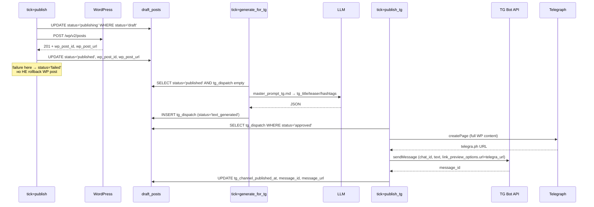

# 06 — Telegram: специфика Bot API и Telegraph

## TL;DR

Два интеграционных слоя: **Bot API** (отправка сообщений в канал,
команды в админ-группу) и **Telegraph API** (Instant View без
Premium). Two-stage публикация: WP независим от TG — сбой TG/Telegraph
не откатывает уже опубликованный WP-пост. Webhook, не long-poll —
после долгих мучений с polling'ом.

## Webhook vs long-poll

Long-poll (`getUpdates` с `timeout=30`) — первое, что приходит в
голову. Мы пробовали. Проблемы:

1. **Сложный деплой webhook.** Если есть webhook, polling выключен;
   если polling работает, webhook нельзя включить без `deleteWebhook`.
   Документация TG не подсвечивает это явно — вы теряете 30 минут
   на «почему я получаю updates и через webhook, и через getUpdates».
2. **Offset persistence.** Чтобы polling не терял updates, нужно
   хранить `update_id` последнего обработанного в файле/БД.
   Расrace condition с двумя инстансами — получаем одни updates
   дважды, теряем другие.
3. **Latency на команды.** Long-poll просыпается раз в N секунд
   (`timeout=30`), плюс сам цикл. Webhook приходит за миллисекунды.
4. **Проблемы с nginx.** Чтобы polling-сервер вышел наружу, его
   надо проксировать через nginx + Let's Encrypt. Для webhook'а —
   то же самое, но **зато получаете нормальный HTTPS** без
   self-signed сертификата (TG требует валидный TLS для webhook).
5. **Last-write-wins race.** Если случайно поднять два инстанса
   polling'а, TG **не гарантирует** at-most-once delivery — будет
   дубль `/approve` (идемпотентность спасает, но логи засоряются).

Webhook проще: один systemd unit слушает 127.0.0.1:8788, nginx
проксирует, TG шлёт updates напрямую. Offset не нужен — TG
гарантирует at-most-once для webhook (если наш 200 OK пришёл).

### Регистрация webhook

```bash
curl -X POST https://api.telegram.org/bot<TOKEN>/setWebhook \
  -d url=https://<your-domain>/telegram-webhook \
  -d secret_token=$(openssl rand -hex 32) \
  -d allowed_updates='["message","edited_message","callback_query"]'
```

Проверка:

```bash
curl -sS https://api.telegram.org/bot<TOKEN>/getWebhookInfo | python -m json.tool
# → "url": "https://<your-domain>/telegram-webhook"
# → "pending_update_count": 0
```

## Telegraph Instant View без Premium

Telegraph (`telegra.ph`) — publishing-платформа Telegram, каждая
страница получает Instant View (one-tap full-page reader) **без
Premium**. Используется как **mirror** нашего WP-поста: TG-channel
post содержит Telegraph-ссылку, TG-клиент рендерит IV поверх неё.

Почему не redirect, а mirror: WP URL остаётся каноническим для
SEO, а Telegraph хранит полную копию текста в его собственном Node-формате.

### Структура Telegraph-страницы

```python
# telegraph.py:create_telegraph_page (фрагмент)
content: List[Dict[str, Any]] = []
if image_src:
    content.append({"tag": "figure", "children": [{"tag": "img", "attrs": {"src": image_src}}]})
for para in body_text.split("\n\n"):
    if para.strip():
        content.append({"tag": "p", "children": [_esc(para)]})
if source_url or wp_url:
    content.append({"tag": "hr"})
if wp_url:
    content.append({"tag": "p", "children": [
        "Еще больше актуальных новостей: ",
        {"tag": "a", "attrs": {"href": wp_url}, "children": [display_domain]},
    ]})
if tag_list:
    hashtag_line = " ".join(f"#{_esc(str(t))}" for t in tag_list if t)
    if hashtag_line:
        content.append({"tag": "p", "children": [hashtag_line]})
```

Telegraph API принимает JSON-список Node-словарей (НЕ raw HTML!);
мы стрипаем HTML в `_html_to_paragraphs` (см. `tg_channel_publisher.py`).
Это **lossy** — таблицы/списки теряются, но для news-text достаточно.

### Регистрация аккаунта Telegraph

```bash
curl -X POST https://api.telegra.ph/createAccount \
  -d short_name=YourBrand \
  -d author_name="Your Brand" \
  -d author_url=https://<your-domain.tld>
# → {"ok": true, "result": {"access_token": "...", ...}}
```

`access_token` положить в `.env` как `TELEGRA_PH_ACCESS_TOKEN`.
`short_name` — это ключ: повторный `createAccount` с тем же
`short_name` вернёт **тот же** token.

### Retry и backoff + IPv4 workaround

```python
# telegraph.py
_RETRY_BACKOFF_SECONDS = (1.0, 2.0, 4.0)
_RETRY_NETWORK_EXC = (OSError, TimeoutError)

def _http_post_with_retry(method, params, *, max_attempts=3):
    for attempt in range(1, max_attempts + 1):
        try:
            return _http_post(method, params)
        except _RETRY_NETWORK_EXC as e:
            if attempt < max_attempts:
                delay = _RETRY_BACKOFF_SECONDS[min(attempt - 1, 2)]
                logger.warning("telegraph {} network error attempt={}/{} — retrying in {:.1f}s",
                               method, attempt, max_attempts, e, delay)
                time.sleep(delay)
    raise TelegraphUnavailable(...)
```

После 3 неудач — `TelegraphUnavailable` (подкласс `TelegraphError`).
`publish_tg` ловит это и **не отправляет** пост в канал — политика
«no IV → no post» (см. [`02-state-machine.md`](02-state-machine.md)).

**IPv6 workaround**: `api.telegra.ph` имеет IPv6, но регулярно
отвечает медленно или таймаутится с VPS'ов, где IPv6 включён
по умолчанию. `urllib.request` сам выбирает stack; для force IPv4
используется стандартный механизм через `socket.getaddrinfo` —
на момент написания `urllib` подключается к IPv4 happy-path.
**История**: Sprint 6d.7 переключался на `curl --ipv4`, Sprint X
вернулся на `urllib` — выбор зависит от текущего состояния сети.
См. комментарии в `telegraph.py:_http_post` (см. раздел "История фиксов" выше).

## Two-stage publish (Sprint Y)



**Ключевое**: WP-пост остаётся опубликованным при любом сбое TG или
Telegraph. `tg_dispatch.attempts` инкрементируется, через
`PIPE_TICKS.tg_max_telegraph_attempts=5` строка паркуется как
`telegram_blocked_exhausted` для ручного разбора.

## Inline buttons и форматирование

TG-сообщения в канале — **plain HTML** (parse_mode='HTML' в
`sendMessage`). Поддерживаемые теги: `<b>`, `<i>`, `<u>`, `<s>`,
`<code>`, `<pre>`, `<a href="...">`. Всё остальное (включая
`<br>`, `<p>`, `<div>`) — TG выкинет с 400 "can't parse entities".

```python
# tg_channel_publisher.py:format_tg_post
parts: list[str] = []
if title:
    parts.append(f"🔴 <b>{_html_escape(title)}</b>")
parts.append(_html_escape(teaser))
if hashtags:
    rendered_tags = " ".join(f"#{_html_escape(str(t))}" for t in hashtags if t)
    parts.append(rendered_tags)
if source_url:
    parts.append(
        f"🔗 Первоисточник: <a href=\"{_html_escape(source_url)}\">{_html_escape(source_label or source_url)}</a>"
    )
if wp_url:
    parts.append(
        f"Наша медиаплатформа: <a href=\"{_html_escape(wp_url)}\">{_DISPLAY_DOMAIN}</a>"
    )
return "\n\n".join(parts)
```

`_html_escape` экранирует `<`, `>`, `&` — обязательно, потому что
LLM может вставить `<3 Anthropic` в title и TG отклонит.

Inline keyboards (кнопки под сообщением) — **не используются**
в текущем шаблоне. Все действия — через `/command` в
админ-супергруппе, не в публичном канале. Если нужны кнопки в
канале — расширяйте `format_tg_post` + добавьте
`reply_markup={"inline_keyboard": [[{"text": "...", "url": "..."}]]}`.

## Rate limits

| Лимит | Значение | Что делаем |
|---|---|---|
| Глобально Bot API | 30 msg/sec | Нет проблем — ≤5 msg/tick |
| Per chat | 1 msg/sec | Если объём вырастет — `time.sleep(1.0)` между `sendMessage` |
| Telegraph | ~3 req/sec (ненадписанный) | retry уже есть |
| WP REST API | зависит от хостинга | tenacity retry |

Если вы планируете >100 постов/день — прочитайте
[Telegram Bot API limits](https://core.telegram.org/bots/faq#broadcasting),
добавьте `time.sleep(1.0)` в `publish_tg.process_one()` и
батчинг Telegraph calls.

## `publish_page` — реальный код

```python
def create_telegraph_page(title, body_text, *, source_url=None,
                          source_label=None, wp_url=None, tag_list=None,
                          image_src=None, access_token=None,
                          author_url=None) -> Optional[str]:
    token = (access_token or os.environ.get("TELEGRA_PH_ACCESS_TOKEN", "")).strip()
    if not token:
        logger.info("telegraph: TELEGRA_PH_ACCESS_TOKEN is empty; skipping")
        return None

    author_url = (author_url or os.environ.get("TELEGRA_PH_AUTHOR_URL",
                   "https://your-domain.example.com")).strip()
    # ... build content nodes (см. выше) ...

    params: Dict[str, Any] = {
        "access_token": token,
        "title": title or "(без заголовка)",
        "author_name": "Media <deploy-user>",
        "author_url": author_url,
        "content": json.dumps(content, ensure_ascii=False),
        "return_content": "false",
    }
    if tag_list:
        params["tag_list"] = json.dumps(list(tag_list), ensure_ascii=False)

    try:
        result = _http_post_with_retry("createPage", params)
    except TelegraphError as e:
        logger.error("telegraph: createPage failed: {}", e)
        raise

    url = (result or {}).get("url", "")
    if not url:
        raise TelegraphError(f"telegraph createPage returned no url; result={result!r}")
    logger.info("telegraph: createPage OK → {}", url)
    return url
```

Полный файл — `telegraph.py:create_telegraph_page`. Файл
выдёргивает из TG-preview'а заголовок и тело, добавляет footer
с WP-ссылкой, отправляет через Telegraph API. При сбое — retry
+ TelegraphUnavailable, который `publish_tg` обрабатывает как
«не публикуем без IV».

## Extension point: кастомный TG-preview

Формат TG-preview описан в `master_prompt_tg.md` — это
system-prompt для `generate_for_tg.tick`. Чтобы изменить
стиль/длину/теги:

```bash
$EDITOR master_prompt_tg.md
git commit -m "tg-preview: короче тизер + 3 хэштега"
git push
ssh <vps-host> 'cd /opt/<deploy-user>/media-fabrique-template && sudo -u <deploy-user> git pull'
```

Затем **обязательно** обновите `prompts.TG_PROMPT_VERSION`:

```python
TG_PROMPT_VERSION = "master_prompt_tg.md@v1.1"  # bumped
```

Это позволяет старым постам сохранить свою версию промпта в
`tg_dispatch.prompt_version`, а новым — получить свежую.

## Где форкать

| Хочется | Файл |
|---|---|
| Сменить формат TG-preview | `master_prompt_tg.md` + `prompts.TG_PROMPT_VERSION` |
| Сменить footer-текст Telegraph | `telegraph.py:create_telegraph_page` (блок `if wp_url:`) |
| Сменить footer-текст TG-channel | `tg_channel_publisher.format_tg_post` |
| Убрать Telegraph IV | удалить `telegraph.create_telegraph_page()` вызов, оставить только `sendMessage` |
| Добавить inline buttons | `tg_channel_publisher.publish` → `payload["reply_markup"]` |
| Кастомный retry policy | `telegraph._RETRY_BACKOFF_SECONDS`, `_RETRY_NETWORK_EXC` |
| Кастомная картинка Telegraph | `telegraph.create_telegraph_page(image_src=...)` + WP featured media |

## Следующее

- [`02-state-machine.md`](02-state-machine.md) — `tg_dispatch` state machine.
- [`03-cron-architecture.md`](03-cron-architecture.md) — cron-расписание TG-тиков.
- [`08-operational-playbook.md`](08-operational-playbook.md) — Telegraph gotchas, IPv6 fix.
