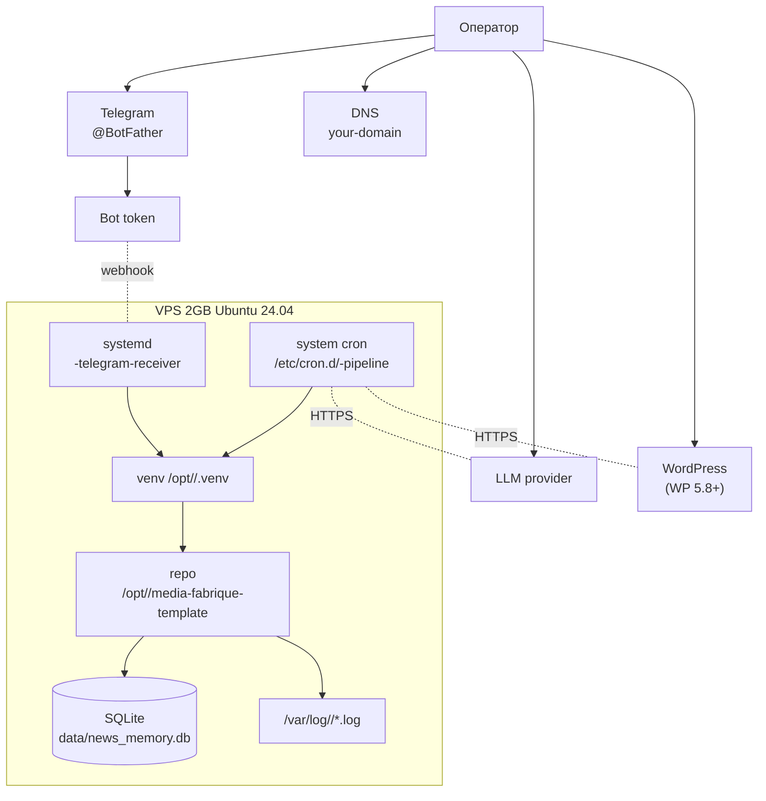

# 07 — Self-host: пошаговый гайд

## TL;DR

Развёртывание Media Fabrique на **один VPS 2 GB**, Ubuntu 24.04.
Никаких внешних зависимостей кроме OpenAI-совместимого LLM,
WordPress и Telegram Bot API. Все компоненты — стандартный apt +
pip. После выполнения чеклиста получаешь работающий конвейер +
smoke 19/19.

## Prerequisites

| Что | Минимум | Где взять |
|---|---|---|
| VPS | 2 GB RAM, 2 vCPU, 20 GB SSD, Ubuntu 24.04 LTS | любой провайдер (Hetzner/OVH/DO) |
| Домен | свой + DNS A-запись на IP VPS | registrar + DNS hosting |
| TLS-сертификат | Let's Encrypt через certbot | бесплатно, авто-обновление |
| Telegram Bot | токен через [@BotFather](https://t.me/BotFather) | `/newbot`, дать права в канале |
| Telegram Channel | публичный или приватный | создать, бот — admin |
| LLM API key | OpenAI / Anthropic-совместимый / локальный | provider |
| WordPress 5.8+ | свой сайт, REST API включён | можно вместе с этим гайдом |
| Application Password | WP → Users → Application Passwords | для WP REST авторизации |
| Telegraph account | `createAccount` (см. ниже) | https://api.telegra.ph/createAccount |

## Архитектура деплоя



## Step-by-step deploy

### 1. Подготовка сервера

```bash
ssh root@<vps-host>

apt update && apt upgrade -y
apt install -y python3 python3-venv python3-pip git curl ufw fail2ban sqlite3 jq

# User для проекта
useradd -m -s /bin/bash <deploy-user>
mkdir -p /opt/<deploy-user> /var/log/<project> /var/backups/<deploy-user>
chown -R <deploy-user>:<deploy-user> /opt/<deploy-user> /var/backups/<deploy-user>
chmod 700 /opt/<deploy-user> /var/backups/<deploy-user>

# SSH hardening (ВАЖНО: проверь что у тебя уже есть рабочий ключ!)
sed -i 's/^#\?PasswordAuthentication.*/PasswordAuthentication no/' /etc/ssh/sshd_config
sed -i 's/^#\?PermitRootLogin.*/PermitRootLogin prohibit-password/' /etc/ssh/sshd_config
systemctl restart sshd
```

Проверь **до** отключения password auth, что у тебя есть SSH-ключ
в `~/.ssh/authorized_keys` для `<deploy-user>`.

### 2. Клонировать репозиторий

```bash
sudo -u <deploy-user> bash -lc '
  git clone https://github.com/DimbikeY/media-fabrique-template.git \
    /opt/<deploy-user>/media-fabrique-template
  python3 -m venv /opt/<deploy-user>/.venv
  /opt/<deploy-user>/.venv/bin/pip install --upgrade pip wheel setuptools
  /opt/<deploy-user>/.venv/bin/pip install -r /opt/<deploy-user>/media-fabrique-template/requirements.txt
'
```

### 3. Заполнить `.env`

```bash
sudo -u <deploy-user> cp /opt/<deploy-user>/media-fabrique-template/.env.example \
                            /opt/<deploy-user>/.env
sudo -u <deploy-user> chmod 600 /opt/<deploy-user>/.env
sudo -u <deploy-user> $EDITOR /opt/<deploy-user>/.env
```

Обязательные поля (см. `.env.example`):

```ini
LLM_BASE_URL=https://api.openai.com/v1
LLM_API_KEY=sk-...                          # ОБЯЗАТЕЛЬНО реальный ключ
LLM_MODEL=gpt-4o-mini

WP_BASE_URL=https://<your-domain.tld>
WP_USERNAME=<wp-author-user>
WP_APP_PASSWORD=xxxx xxxx xxxx xxxx xxxx xxxx   # Application Password, с пробелами

TELEGRAM_BOT_TOKEN=1234567890:AAF...
TG_CHAT_ID=-100XXXXXXXXXX                      # supergroup для observability
TG_THREAD_PUBLISHED=3
TG_THREAD_FEEDBACK=5
TG_THREAD_MORNING_REPORT=7
TG_THREAD_PUBLISHED_TG=977
TG_THREAD_DRAFTS=237
TG_THREAD_TG_VALIDATION=                       # если есть #validation topic
TG_DD_USERNAME=your_tg_username                # твой @handle
TG_CHANNEL_ID=-100YYYYYYYYYY                   # numeric chat_id канала
TG_CHANNEL_USERNAME=<your_channel>             # @handle канала без @

TELEGRA_PH_ACCESS_TOKEN=                       # см. ниже
TELEGRA_PH_AUTHOR_URL=https://<your-domain.tld>
MEDIA_DISPLAY_DOMAIN=<your-domain.tld>
TELEGRAM_WEBHOOK_BASE_URL=https://<your-domain.tld>
TELEGRAM_ADMIN_GROUP_CHAT_ID=-100XXXXXXXXXX

WP_PUBLISH_AUTO_APPROVE=1                      # 1 = auto, 0 = manual /approve
TG_PUBLISH_AUTO_APPROVE=0                      # 1 = auto, 0 = manual /approve_tg
TELEGRAPH_REQUIRED_FOR_PUBLISH=1               # 1 = WP rollback if Telegraph fails
```

**WP_APP_PASSWORD** содержит пробелы — в `wp-publisher.py` они
экранируются внутри строки, но `.env` должен использовать
**одинарные кавычки** или escaping, если shell-обёртка cron'а
передаёт значение без кавычек. **Gotcha #4** в
[`08-operational-playbook.md`](08-operational-playbook.md).

### 4. Telegraph account

```bash
curl -X POST https://api.telegra.ph/createAccount \
  -d short_name=<your-domain> \
  -d author_name="Your Brand" \
  -d author_url=https://<your-domain.tld> | jq .
# → ok=true, result.access_token="abcdef..."

# Вставить в .env:
TELEGRA_PH_ACCESS_TOKEN=abcdef...
```

### 5. WordPress + Application Password

В WP-админке: **Users → Profile → Application Passwords → Add New**.
Скопировать пароль (формат `xxxx xxxx xxxx xxxx xxxx xxxx`) в
`WP_APP_PASSWORD`.

### 6. Инициализация БД

```bash
sudo -u <deploy-user> /opt/<deploy-user>/.venv/bin/python \
  /opt/<deploy-user>/media-fabrique-template/init_db.py

sudo -u <deploy-user> /opt/<deploy-user>/.venv/bin/python \
  /opt/<deploy-user>/media-fabrique-template/migrate.py
```

Первая команда создаёт схему (`candidates`, `draft_posts`,
`tg_dispatch`, `comments`, `llm_runs`, `sources`). Вторая
применяет миграции (идемпотентно через `_migrations`).

### 7. systemd unit — telegram-receiver

`/etc/systemd/system/<project>-telegram-receiver.service`:

```ini
[Unit]
Description=<project> Telegram webhook receiver
After=network-online.target
Wants=network-online.target

[Service]
Type=simple
User=<deploy-user>
Group=<deploy-user>
WorkingDirectory=/opt/<deploy-user>/media-fabrique-template

EnvironmentFile=/opt/<deploy-user>/.env
Environment=PYTHONUNBUFFERED=1
Environment=LANG=C.UTF-8

ExecStart=/opt/<deploy-user>/.venv/bin/python -m telegram_receiver
Restart=on-failure
RestartSec=5
TimeoutStopSec=15

NoNewPrivileges=true
ProtectSystem=strict
ProtectHome=true
PrivateTmp=true
ReadWritePaths=/opt/<deploy-user>/media-fabrique-template/data /var/log/<project>

[Install]
WantedBy=multi-user.target
```

```bash
sudo systemctl daemon-reload
sudo systemctl enable --now <project>-telegram-receiver.service
sudo systemctl status <project>-telegram-receiver
# → Active: active (running)
```

### 8. cron — все 6 тиков

`/etc/cron.d/<project>-pipeline`:

```cron
# /etc/cron.d/<project>-pipeline
SHELL=/bin/bash
PATH=/opt/<deploy-user>/.venv/bin:/usr/local/bin:/usr/bin:/bin
PYTHONUNBUFFERED=1
LANG=C.UTF-8
TZ=Europe/Moscow

*/30 * * * *   <deploy-user>  cd /opt/<deploy-user>/media-fabrique-template && .venv/bin/python main.py tick=fetch          >> /var/log/<project>/fetch.log      2>&1
*/7  * * * *   <deploy-user>  cd /opt/<deploy-user>/media-fabrique-template && .venv/bin/python main.py tick=rewrite        >> /var/log/<project>/rewrite.log    2>&1
*/5  * * * *   <deploy-user>  cd /opt/<deploy-user>/media-fabrique-template && .venv/bin/python main.py tick=publish        >> /var/log/<project>/publisher.log  2>&1
*/5  * * * *   <deploy-user>  cd /opt/<deploy-user>/media-fabrique-template && .venv/bin/python main.py tick=generate_for_tg >> /var/log/<project>/gen_tg.log     2>&1
*/10 * * * *   <deploy-user>  cd /opt/<deploy-user>/media-fabrique-template && .venv/bin/python main.py tick=publish_tg      >> /var/log/<project>/publish_tg.log 2>&1
0    * * * *   <deploy-user>  cd /opt/<deploy-user>/media-fabrique-template && .venv/bin/python main.py tick=janitor        >> /var/log/<project>/janitor.log    2>&1

# Morning report
0  7 * * *   <deploy-user>  /opt/<deploy-user>-ops/bin/mf-morning-report.sh >> /var/log/<project>/mf-morning.log 2>&1
```

```bash
sudo chmod 644 /etc/cron.d/<project>-pipeline
sudo chown root:root /etc/cron.d/<project>-pipeline
```

### 9. nginx reverse proxy

`/etc/nginx/sites-enabled/<your-domain>` (HTTPS-секция):

```nginx
# Telegram webhook — обязательно до общего location /
location = /telegram-webhook {
    proxy_pass http://127.0.0.1:8788;
    proxy_http_version 1.1;
    proxy_set_header Host $host;
    proxy_set_header X-Real-IP $remote_addr;
    proxy_set_header X-Forwarded-For $proxy_add_x_forwarded_for;
    proxy_set_header X-Forwarded-Proto $scheme;
    proxy_read_timeout 60s;
    proxy_send_timeout 60s;
    proxy_buffering off;
}

# WordPress — основной сайт
location / {
    proxy_pass http://127.0.0.1:8080;     # или unix:/run/php/php8.3-fpm.sock
    # ... стандартный WP-блок ...
}
```

```bash
sudo nginx -t && sudo nginx -s reload
```

Регистрация webhook:

```bash
curl -X POST https://api.telegram.org/bot<TOKEN>/setWebhook \
  -d url=https://<your-domain>/telegram-webhook \
  -d secret_token=$(openssl rand -hex 32) \
  -d allowed_updates='["message","edited_message","callback_query"]'

# Verify
curl -sS https://api.telegram.org/bot<TOKEN>/getWebhookInfo | jq .
# → url: "https://<your-domain>/telegram-webhook"
```

### 10. Backup

```bash
# /etc/cron.d/<project>-backup
0 3 * * *   <deploy-user>  sqlite3 \
  /opt/<deploy-user>/media-fabrique-template/data/news_memory.db \
  ".backup /var/backups/<deploy-user>/news_memory_$(date +\%Y\%m\%d).db"

# Retention
0 4 * * *   <deploy-user>  find /var/backups/<deploy-user> -name 'news_memory_*.db' -mtime +30 -delete
```

Off-site (пример с `rclone` на S3-compatible):

```bash
# /etc/cron.d/<project>-backup-s3
0 5 * * *   <deploy-user>  rclone copy \
  /var/backups/<deploy-user>/news_memory_latest.db \
  s3:<bucket>/<project>/news_memory/ \
  --config=/etc/rclone.conf
```

### 11. logrotate

`/etc/logrotate.d/<project>`:

```bash
/var/log/<project>/*.log {
    daily
    missingok
    rotate 14
    compress
    delaycompress
    notifempty
    create 0640 <deploy-user> <deploy-user>
    sharedscripts
    postrotate
        systemctl reload <project>-telegram-receiver.service >/dev/null 2>&1 || true
    endscript
}
```

### 12. Post-deploy smoke

```bash
sudo -u <deploy-user> /opt/<deploy-user>/.venv/bin/python \
  /opt/<deploy-user>/media-fabrique-template/test_sprint_y_e2e_smoke.py
```

**Ожидаемый результат**: `19/19 PASS`. Любой fail = либо проблема с
`.env`, либо с миграциями, либо с сетью к LLM/WP. Диагностика —
в [`08-operational-playbook.md`](08-operational-playbook.md).

### 13. Проверка end-to-end

```bash
# Смотрим первый fetch
sudo -u <deploy-user> bash -lc '
  cd /opt/<deploy-user>/media-fabrique-template
  .venv/bin/python main.py tick=fetch --max 5
'

# Смотрим SQLite
sudo -u <deploy-user> sqlite3 /opt/<deploy-user>/media-fabrique-template/data/news_memory.db \
  "SELECT COUNT(*), status FROM candidates GROUP BY status;"
# Должно быть что-то в 'new'

# Идём дальше
sudo -u <deploy-user> bash -lc '
  cd /opt/<deploy-user>/media-fabrique-template
  .venv/bin/python main.py tick=rewrite --limit 3
'
sudo -u <deploy-user> bash -lc '
  cd /opt/<deploy-user>/media-fabrique-template
  .venv/bin/python main.py tick=publish --limit 1
'

# Проверить в WP — должен появиться пост.

# И в TG-channel (если настроен auto):
sudo -u <deploy-user> bash -lc '
  cd /opt/<deploy-user>/media-fabrique-template
  .venv/bin/python main.py tick=generate_for_tg --limit 1
  .venv/bin/python main.py tick=publish_tg --limit 1
'
```

## Security

| Контроль | Что сделать |
|---|---|
| SSH force-command | `AuthorizedKeysCommand` или `from=...` в `~/.ssh/authorized_keys` |
| ed25519 ключи | `ssh-keygen -t ed25519` (не RSA) |
| fail2ban | `apt install fail2ban` + jail для sshd |
| ufw | default deny incoming, allow 22/80/443 |
| no IPv6 (опционально) | `sysctl net.ipv6.conf.all.disable_ipv6=1` (если не нужен) |
| Secret rotation | `.env` права `600`, никогда не коммитить |
| `app passwords` | только для WP REST, не использовать обычный пароль |

SSH-ключ для оператора:

```bash
# На операторской машине
ssh-keygen -t ed25519 -C "operator@<your-domain>"
ssh-copy-id -i ~/.ssh/id_ed25519.pub <deploy-user>@<vps-host>

# Verify
ssh <deploy-user>@<vps-host> 'whoami; uptime'
```

## Что мониторить

- `logs/.last_tick` — heartbeat JSON. `cat /opt/<deploy-user>/media-fabrique-template/logs/.last_tick | jq .` покажет последний тик + exit code.
- `/var/log/<project>/*.log` — каждое слово от loguru.
- `journalctl -u <project>-telegram-receiver` — для systemd-юнита.
- `morning_report` — daily push в TG #morning-report topic.

## Где форкать

| Что поменять | Файл |
|---|---|
| Cron-расписание | `/etc/cron.d/<project>-pipeline` |
| systemd unit | `/etc/systemd/system/<project>-telegram-receiver.service` |
| nginx location | `/etc/nginx/sites-enabled/<your-domain>` |
| logrotate | `/etc/logrotate.d/<project>` |
| Backup retention | `/etc/cron.d/<project>-backup` |
| Hardening (SSH, ufw, fail2ban) | `deploy/vps-b-setup.sh` — reference deploy script |

## Следующее

- [`03-cron-architecture.md`](03-cron-architecture.md) — почему cron, а не k8s.
- [`08-operational-playbook.md`](08-operational-playbook.md) — топ-5 инцидентов и gotchas.
