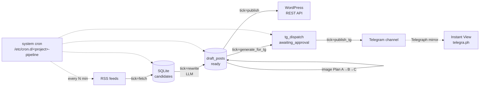

# Media Fabrique Template

> **Self-hosted RSS → LLM-rewriter → WordPress / Telegram pipeline.**
> A template — fork it, adapt for your topic, deploy it.

[](LICENSE)
[](requirements.txt)
[](.github/workflows/ci.yml)
[](https://github.com/DimbikeY/media-fabrique-template)

[🇷🇺 Русская версия](../../README.md)

---

## TL;DR

A ready-made pipeline for a news channel: pulls RSS feeds, sends text to an
LLM for rewriting, generates an image, publishes to WordPress and a
Telegram channel. Topic-agnostic by design — sources, prompts and
categories are parameterized so you can fork it for your domain:
industry news, niche communities, corporate monitoring, research digests.

Latency from RSS fetch to channel publish: ~30 minutes in steady state.
A single 2 GB VPS handles 30+ posts per day.

## Why this exists as a template

I built the original pipeline for my own news channel and extracted the
reusable core. Fork it, swap RSS sources for yours, rewrite the prompt
for your topic, point it at your WordPress and Telegram channel — in
an hour you'll have a working pipeline. All state lives in SQLite,
migrations are included, smoke tests run in isolation.

This is a **template**, not a production product: no built-in telemetry,
no auto-updates, no SLA. Use at your own risk, without warranties or
support obligations. If you need help — open an
[issue](https://github.com/DimbikeY/media-fabrique-template/issues).

## Demo

- **Telegram channel** with live posts: `@<your_channel>` (replace with yours)
- **Longread (EN)** with the architecture deep-dive (10 sections): <https://github.com/DimbikeY/media-generation-fabrique/blob/public-release-clean/docs/longread-en.md>
- **Longread (RU)** with the architecture deep-dive (10 sections): <https://github.com/DimbikeY/media-generation-fabrique/blob/public-release-clean/docs/longread-ru.md>
- **Issues**: <https://github.com/DimbikeY/media-fabrique-template/issues>

## Architecture



**One pipeline cycle = one cron tick.** Each component runs independently,
reads and writes SQLite state idempotently (UPDATE ... WHERE status=?
AND id=? with rowcount==1). Details — in
[`docs/architecture/`](../architecture/).

## Quickstart (≤ 30 minutes)

```bash
# 1. Clone and install dependencies
git clone https://github.com/DimbikeY/media-fabrique-template.git
cd media-fabrique-template
python3 -m venv .venv && source .venv/bin/activate
pip install -r requirements.txt

# 2. Copy env template and fill in your keys
cp .env.example .env
$EDITOR .env   # fill in:
               #   LLM_BASE_URL, LLM_API_KEY, LLM_MODEL
               #   WP_BASE_URL, WP_USERNAME, WP_APP_PASSWORD
               #   TELEGRAM_BOT_TOKEN, TELEGRAM_ADMIN_GROUP_CHAT_ID,
               #     TG_DD_USERNAME, TG_CHANNEL_ID, TG_CHANNEL_USERNAME

# 3. Initialize SQLite + migrations
python init_db.py
python migrate.py

# 4. First manual pipeline run
python main.py tick=fetch       # pull RSS into candidates
python main.py tick=rewrite     # LLM rewrite + scoring
python main.py tick=publish     # publish to WordPress
python main.py tick=janitor     # clean expired

# 5. Set up cron on your VPS — see docs/architecture/07-self-host.md
```

After `tick=fetch`, rows will appear in the `candidates` table of
`data/news_memory.db`. If RSS feeds are empty or your LLM key is wrong —
`tick=rewrite` will fail with a clear traceback in `logs/`.

## Features

- **State machine in SQLite.** `candidates` (new → rewriting → ready /
  skipped / failed), `draft_posts` (draft → publishing → published /
  failed), `tg_dispatch` (pending_tg_text → awaiting_approval → approved
  → published_tg / rejected_tg). Idempotent UPDATEs with rowcount==1,
  migrations via `migrate.py` (idempotent, tracked in `_migrations`).
- **Cron instead of an orchestrator.** System cron + systemd unit, a
  separate tick for each phase: `tick=fetch`, `tick=rewrite`,
  `tick=publish`, `tick=janitor`, `tick=generate_for_tg`, `tick=publish_tg`.
  Backoff, jitter, error handling per tick. See
  [`docs/architecture/03-cron-architecture.md`](../architecture/03-cron-architecture.md).
- **LLM via OpenAI-compatible SDK.** `openai>=1.40` works with any
  provider: OpenAI, Anthropic-compatible endpoints, local models.
  Tenacity retries, prompt version pinning (`prompts.TG_PROMPT_VERSION`).
- **Categorization (closed-set).** 12 categories in a whitelist — LLM
  doesn't classify at runtime, only picks from the list. Saves tokens
  and stabilizes output. See
  [`docs/architecture/04-categorization.md`](../architecture/04-categorization.md).
- **Telegram channel + Instant View without Premium.** Telegraph mirror
  with the full post body. `tg_dispatch` is separate from WordPress
  (two-stage): WP publish and TG publish are independent — TG can never
  roll back a WP post. See
  [`docs/architecture/06-telegram-specifics.md`](../architecture/06-telegram-specifics.md).
- **Image pipeline (Plan A→B→C→D).** WebP lossy q=82 method=6
  (WP 5.8+ accepts natively) → upstream image from RSS → image-gen API →
  placeholder. Inline in publisher, not a separate cron.
- **Self-hosted, single VPS.** One 2 GB VPS handles 30+ posts/day. SQLite
  for state, no external dependencies beyond the LLM API. Backups —
  `cron` + `sqlite3 .backup`.

## Tech stack

- **Python 3.11+**, local `.venv`
- **SQLite** for state + migrations (`migrate.py`)
- **OpenAI-compatible SDK** for LLM (`openai>=1.40`)
- **WordPress REST API + Application Passwords** for publishing
- **Telegram Bot API + Telegraph API** for channel and Instant View
- **Pillow** for image pipeline (WebP encode)
- **feedparser + readability-lxml** for RSS and HTML normalization
- **Tenacity, loguru** — retries and structured logging

## Customize (where to fork for your topic)

| Component | File / location | What to change |
|---|---|---|
| RSS feeds | `rss_fetcher.py` | List of sources and feed parsers |
| Main prompt | `master_prompt.md` | System instructions for the LLM (RU/EN, tone, length) |
| TG prompt | `master_prompt_tg.md` + `prompts.py` | TG preview format, emojis, hashtag style |
| Categories | `config.py` (`CATEGORIES_WHITELIST`) | Your closed-set topic list |
| State machine | `models.py` + `migrate.py` | Add custom statuses if needed |
| Cron schedule | `deploy/<project>-pipeline.cron` | Intervals for your volume |
| Branding | README + Telegraph + TG channel handle | Name, logo, description |
| Image prompt | `image_pipeline.py` (`build_prompt`) | Image style for your topic |
| Deploy | `deploy/vps-b-setup.sh` (or your own) | Adapt to your VPS provider |

## Self-host

Full guide — [`docs/architecture/07-self-host.md`](../architecture/07-self-host.md):
prerequisites (VPS 2 GB, domain, TG bot, OpenAI-compatible key), step-by-step
deploy on Ubuntu 24.04, systemd unit, `/etc/cron.d/<project>-pipeline`, nginx
reverse proxy (if needed), SQLite backups.

Pre-production checklist — in
[`docs/architecture/08-operational-playbook.md`](../architecture/08-operational-playbook.md).

## Contributing

Issues welcome. PRs without a prior issue aren't accepted — let's discuss
the design before code. Strict code review:

1. 100% smoke pass (`test_*_smoke.py` in isolated DB)
2. Manual test on a clean clone before merge
3. Match existing code style (typing, docstrings, naming)

License — [MIT](../../LICENSE). Use anywhere, fork freely, attribution
appreciated but not required.

## License

[MIT](../../LICENSE) — see file. Copyright returns to contributors via CLA
(if the project grows beyond a single maintainer).

## Disclaimer

**This is a template, not a production-ready product.**

- Use **at your own risk**, without any warranties.
- The author **provides no technical support** and takes no
  responsibility for misuse, data loss, or third-party TOS violations.
- Before using, make sure you comply with:
  - **Your RSS sources' TOS** — not all feeds allow republication.
    Respect robots.txt, rate limits, and explicit author requests.
  - **[Telegram ToS](https://telegram.org/tos)** — especially the
    mass-mailing and automation sections.
  - **[OpenAI ToS](https://openai.com/policies/row-terms-of-use/)** —
    limits, restricted use cases, attribution requirements.
  - **WordPress.com / .org ToS** — automated publishing is fine,
    but no spam.
  - **Source copyrights** — LLM-mediated summary ≠ full republication.
    Summarize, don't copy-paste, and always cite the source.

This repo doesn't claim "production-ready" status and doesn't replace
legal consultation for your specific jurisdiction and scenario.

## Acknowledgments

Open source this stands on:

- [OpenAI Python SDK](https://github.com/openai/openai-python)
- [feedparser](https://github.com/kurtmckee/feedparser)
- [Pillow](https://github.com/python-pillow/pillow)
- [Tenacity](https://github.com/jd/tenacity)
- [Loguru](https://github.com/Delgan/loguru)
- [python-telegram-bot](https://github.com/python-telegram-bot/python-telegram-bot) (optional)
- [Telegraph API](https://telegra.ph/api) — Instant View without Premium
- [Readability](https://github.com/buriy/python-readability) — HTML normalization

---

🇷🇺 [Русская версия](../../README.md) · [Architecture](../architecture/) · [Issues](https://github.com/DimbikeY/media-fabrique-template/issues) · [MIT License](../../LICENSE)